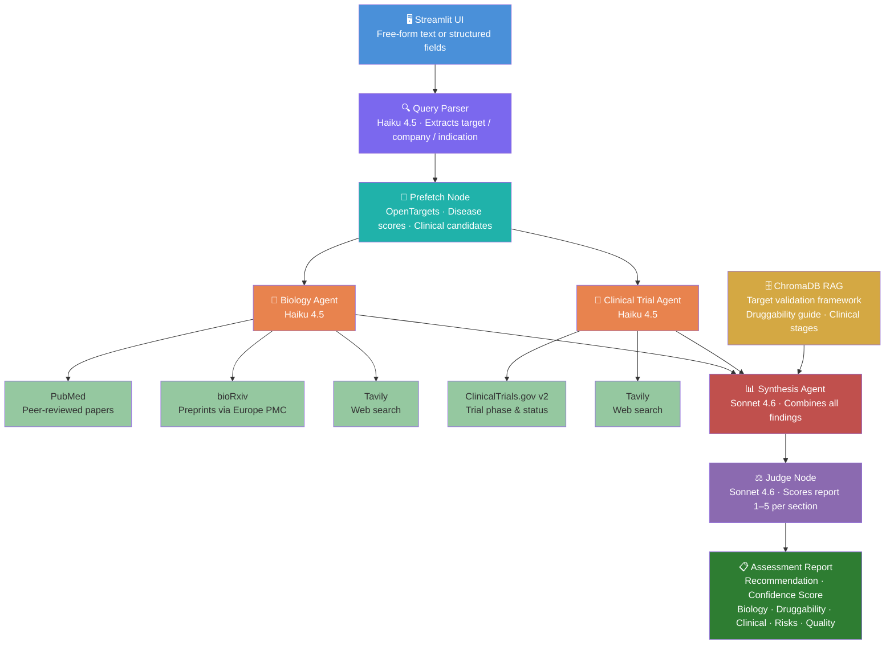

# Biotech Target Assessment Agent

A multi-agent system that evaluates whether a biotech company's drug target is likely to yield a successful large molecule (antibody/biologic) therapeutic.

Built with LangGraph, Claude Haiku + Sonnet, and free public APIs (OpenTargets, PubMed, ClinicalTrials.gov, bioRxiv). Designed for accuracy on a personal budget.

**Live demo:** Deployed on AWS ECS Fargate (ARM64 Graviton2) — http://18.145.238.250:8501

---

## Architecture



```
User Input — free-form text or structured fields
              │
        [Query Parser]        Haiku extracts target / company / indication
              │
     [LangGraph Orchestrator]
              │
          [Prefetch]          OpenTargets + UniProt (deterministic baseline)
              │ parallel fan-out
    ┌─────────┴──────────┐
    ▼                    ▼
[Biology Agent]   [Clinical Trial Agent]
  Haiku 4.5          Haiku 4.5
  · PubMed           · ClinicalTrials.gov v2
  · bioRxiv          · Tavily web search
  · Tavily web
    └─────────┬──────────┘
              ▼
      [Synthesis Agent]
         Sonnet 4.6
         · ChromaDB RAG
         · Structured report
              ▼
         [Judge Node]         Sonnet scores report quality (1–5 per section)
              │
        Assessment Report + Quality Panel → User
```

### Node responsibilities

| Node | Model | Role |
|------|-------|------|
| **Query Parser** | Haiku 4.5 | Extracts target / company / indication from free-form text |
| **Prefetch** | — (API calls) | Fetches OpenTargets scores and UniProt protein profile before agents run |
| **Biology Agent** | Haiku 4.5 | Searches PubMed, bioRxiv, and web for disease biology, genetic evidence, preclinical validation, safety signals |
| **Clinical Trial Agent** | Haiku 4.5 | Searches ClinicalTrials.gov and web for clinical precedent, trial status, failures, and competitive landscape |
| **Synthesis Agent** | Sonnet 4.6 | Combines all findings with RAG context to produce a structured report with confidence score and recommendation |
| **Judge Node** | Sonnet 4.6 | Scores each report section (1–5) against a rubric; surfaces weakest section and top improvement to the user |

---

## Data Sources

### Pre-fetch (always called, deterministic)

| Source | What it provides |
|--------|-----------------|
| **OpenTargets** | Disease-target association scores, genetic evidence score, known drugs/clinical programs, safety liabilities |
| **UniProt** | Protein function, subcellular location, transmembrane domains, disease associations |

### Biology Agent tools

| Source | What it provides |
|--------|-----------------|
| **PubMed** (NCBI E-utilities) | Peer-reviewed literature — disease mechanism, animal models, biomarker studies |
| **bioRxiv / medRxiv** (Europe PMC) | Preprints — cutting-edge findings not yet peer-reviewed |
| **Tavily** | Web search — company pipeline pages, press releases, investor decks |

### Clinical Trial Agent tools

| Source | What it provides |
|--------|-----------------|
| **ClinicalTrials.gov v2** | Trial phase, status, sponsor, indication for same target and related mechanisms |
| **Tavily** | Recent trial news, FDA decisions, competitor updates |

### RAG Knowledge Base (ChromaDB, local)

Three curated seed documents retrieved by the synthesis agent:

| File | Content |
|------|---------|
| `target_validation_framework.md` | Tiered evidence tiers (genetic → functional), red flags |
| `large_molecule_druggability.md` | Antibody format selection, extracellular vs intracellular, PK |
| `clinical_development_stages.md` | Phase success rates, accelerated pathways, common failure reasons |

Add your own `.md` files to `rag/data/` and delete `rag/chroma_db/` to re-ingest.

---

## Report Output

Each assessment produces:

- **Recommendation**: Strong / Moderate / Weak / Against
- **Confidence score**: 0–10 with reasoning
- **Biology rationale**: genetic evidence, disease mechanism, preclinical validation, safety
- **Druggability assessment**: large molecule accessibility, format recommendation, PK
- **Clinical precedent**: trials for this target and related mechanisms, phase + status
- **Competitive landscape**: approved drugs, other programs, crowding risk
- **Key risks**: 3–5 specific, actionable concerns
- **Report quality panel**: section-by-section scores from the judge node

---

## Evaluation Module

The `eval/` module tests agent quality at development time — run it after changing prompts or models.

```
eval/
├── ground_truth.py       # 8 curated test cases (FDA approvals + documented Phase 3 failures)
├── llm_judge.py          # Section-by-section rubric scoring using Sonnet
├── consistency_check.py  # Runs agent twice, flags low-reliability outputs
└── runner.py             # Smart routing: L1 + L2 for known targets, consistency + L2 for novel
```

**Routing logic:**
- **Known target** (in ground truth DB) → Level 1 ground truth score → Level 2 LLM judge on failure
- **Novel target** (no ground truth) → Consistency check (run twice) → Level 2 LLM judge

```bash
# Run full test suite (all 8 ground truth cases)
python -m eval.runner

# Evaluate a specific known target
python -m eval.runner --target TIGIT --company Roche --indication NSCLC

# Evaluate a novel target (auto-routes to consistency + judge)
python -m eval.runner --target VISTA --company ImmuNext --indication "solid tumors"
```

**Ground truth sources:** FDA Purple Book (approved biologics), published Phase 3 trial results.

---

## Deployment (AWS)

The app is containerised with Docker and deployed to AWS ECS Fargate.

### Infrastructure

| Component | AWS Service |
|-----------|------------|
| Container image | ECR (Elastic Container Registry) |
| Container runtime | ECS Fargate (ARM64 Graviton2) |
| API keys | Secrets Manager |
| Logs | CloudWatch `/ecs/biotech-target-agent` |

### Deploy from scratch

**Prerequisites:** AWS CLI configured, Docker Desktop running.

```bash
# One-time infrastructure setup
./deploy/setup.sh

# Build, push, and deploy
./deploy/deploy.sh

# Get current public URL
./deploy/get-url.sh
```

### Manage the running service

```bash
# Watch live logs
aws logs tail /ecs/biotech-target-agent --follow --region us-west-1

# Stop service (save cost when not demoing)
aws ecs update-service --cluster biotech-target-agent \
    --service biotech-target-agent --desired-count 0 --region us-west-1

# Restart service
aws ecs update-service --cluster biotech-target-agent \
    --service biotech-target-agent --desired-count 1 --region us-west-1
```

### Cost estimate (AWS)

| Resource | Cost |
|----------|------|
| Fargate 0.5 vCPU + 1GB RAM (ARM64) | ~$22/month |
| Secrets Manager (3 secrets) | ~$1.20/month |
| CloudWatch logs | ~$0.50/month |
| ECR storage | free (under 500MB) |
| **Total** | **~$24/month** |

---

## Local Setup

### 1. Clone and install

```bash
git clone https://github.com/your-username/biotech-target-agent.git
cd biotech-target-agent
python -m venv .venv && source .venv/bin/activate
pip install -r requirements.txt
```

### 2. API keys

```bash
cp .env.example .env
```

Edit `.env`:

```
ANTHROPIC_API_KEY=...   # https://console.anthropic.com
TAVILY_API_KEY=...      # https://tavily.com (free tier: 1000 searches/month)
NCBI_EMAIL=...          # any email — required by PubMed API policy
```

OpenTargets, UniProt, ClinicalTrials.gov, and bioRxiv are all free with no key required.

### 3. Run

```bash
streamlit run app.py
```

The ChromaDB knowledge base is built automatically on first launch. The `BAAI/bge-base-en-v1.5` embedding model (~440MB) is downloaded once and cached locally.

---

## Cost Estimate

| Component | Model / Service | Cost per query |
|-----------|----------------|---------------|
| Query parser | Claude Haiku 4.5 | ~$0.001 |
| Prefetch | OpenTargets + UniProt (free APIs) | $0 |
| Biology agent | Claude Haiku 4.5 | ~$0.005–0.01 |
| Clinical trial agent | Claude Haiku 4.5 | ~$0.005–0.01 |
| Synthesis | Claude Sonnet 4.6 | ~$0.02–0.05 |
| Judge node | Claude Sonnet 4.6 | ~$0.02–0.03 |
| Web search | Tavily (free tier: 1000/month) | $0 |
| Embeddings | sentence-transformers (local CPU) | $0 |
| **Total** | | **~$0.05–0.10 per query** |

---

## Tech Stack

- **Orchestration**: LangGraph (StateGraph — prefetch → parallel → synthesis → judge)
- **LLMs**: Claude Haiku 4.5 (search agents, parser) + Claude Sonnet 4.6 (synthesis, judge)
- **Vector store**: ChromaDB (local, persistent)
- **Embeddings**: `BAAI/bge-base-en-v1.5` via sentence-transformers (CPU)
- **APIs**: OpenTargets GraphQL, UniProt REST, PubMed E-utilities, ClinicalTrials.gov v2, Europe PMC (bioRxiv), Tavily
- **UI**: Streamlit

---

## Example Queries

These work well as test cases since ground truth is known:

| Target | Company | Indication | Expected |
|--------|---------|------------|----------|
| PD-L1 | Genentech | NSCLC | Strong (approved) |
| IL-6R | Roche | Rheumatoid arthritis | Strong (approved) |
| HER2 | Genentech | Breast cancer | Strong (approved) |
| TROP2 | Gilead | Triple-negative breast cancer | Strong (approved ADC) |
| TIGIT | Roche | NSCLC | Against (Phase 3 failed 2023) |

---

## Project Structure

```
biotech-target-agent/
├── app.py                        # Streamlit UI
├── config.py                     # All model names, prompts, and constants
├── requirements.txt
├── .env.example
├── graph/
│   ├── state.py                  # LangGraph shared state (TypedDict)
│   ├── orchestrator.py           # Graph definition and compilation
│   └── nodes/
│       ├── prefetch.py           # OpenTargets + UniProt pre-fetch
│       ├── biology.py            # Biology search agent
│       ├── clinical_trials.py    # Clinical trial search agent
│       ├── synthesis.py          # Report synthesis agent
│       └── judge.py              # LLM-as-judge quality node
├── tools/
│   ├── query_parser.py           # Free-form input → structured fields
│   ├── opentargets.py            # OpenTargets GraphQL API
│   ├── pubmed.py                 # PubMed E-utilities API
│   ├── biorxiv.py                # bioRxiv/medRxiv via Europe PMC
│   ├── clinicaltrials.py         # ClinicalTrials.gov v2 API
│   └── web_search.py             # Tavily web search
├── rag/
│   ├── vectorstore.py            # ChromaDB + sentence-transformers
│   ├── ingestion.py              # Markdown → chunks → embeddings
│   └── data/                     # Curated biotech knowledge documents
├── eval/
│   ├── ground_truth.py           # Curated test cases + L1 scoring
│   ├── llm_judge.py              # Section rubric scoring (L2)
│   ├── consistency_check.py      # Reliability check for novel targets
│   └── runner.py                 # Evaluation orchestrator
├── models/
│   └── schemas.py                # Pydantic output models
├── deploy/
│   ├── setup.sh                  # One-time AWS infrastructure setup
│   ├── deploy.sh                 # Build, push, and deploy to Fargate
│   └── get-url.sh                # Print current public IP
├── Dockerfile                    # Container definition (linux/arm64)
└── .dockerignore
```
